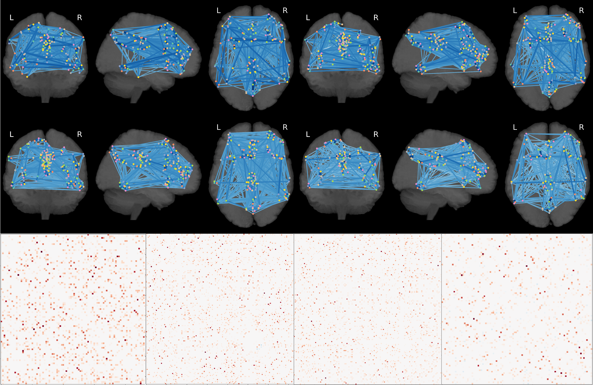

PyNets™
=======

About
-----
PyNets harnesses the power of Nipype, Nilearn, Dipy, and Networkx packages to automatically generate graphical ensembles on a subject-by-subject basis, using any combination of graph-generating hyperparameters. PyNets utilities can be integrated with any existing preprocessing workflow, and a docker container is provided to facilitate complete reproducibility of executions.

Documentation
-------------
Official installation, user-guide, and API docs now live here: https://pynets.readthedocs.io/en/latest/

Citing
------
A manuscript is in preparation, but for now, please cite all uses with reference
to the github repository: https://github.com/dPys/PyNets

