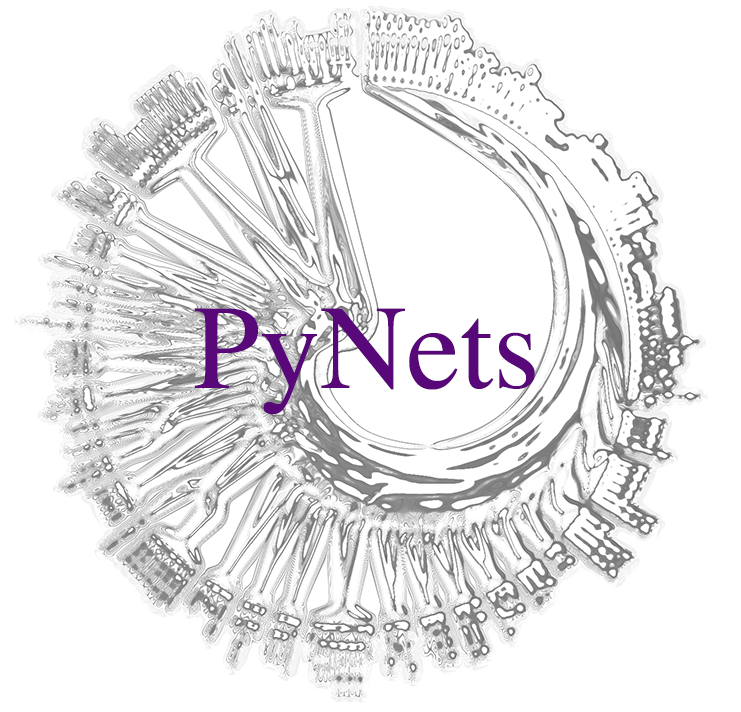

PyNets™
=======
[](https://travis-ci.org/dPys/PyNets)
[](https://circleci.com/gh/dPys/PyNets)
[](https://codecov.io/gh/dPys/PyNets?branch=master)
[](https://pypi.org/project/pynets/)

[](https://www.gnu.org/licenses/gpl-3.0)



About
-----
PyNets is a tool for sampling and analyzing varieties of individual structural and functional connectomes. PyNets enables the user to specify any of a variety of methodological choices known to impact node and/or edge definition, and then sample the prescribed connectome estimates, in a massively parallel framework, conducive to grid-search. PyNets is a post-processing workflow, which means that it can be run on virtually any preprocessed fMRI or dMRI data. It draws from Dipy, Nilearn, GrasPy, and Networkx libraries, but is powered primarily through the Nipype workflow engine. PyNets can now also be deployed as a BIDS application, where it takes BIDS derivatives and makes BIDS derivatives. 

Install
-------
Dockerhub (preferred):
```
docker pull dpys/pynets:latest
```

Manual (Requires a local dependency install of FSL version >=5.0.9):
```
pip install pynets
```
or 
```
git clone https://github.com/dpys/pynets
cd PyNets
python setup.py install
```

Documentation
-------------
Explore official installation instruction, user-guide, API, and examples: <https://pynets.readthedocs.io/en/latest/>

Citing
------
A manuscript is in preparation, but for now, please cite all uses with the following entry:
```
@CONFERENCE{
    title = {PyNets: A Reproducible Workflow for Structural and Functional Connectome Ensemble Learning},
    author = {Pisner, D., Hammonds R.}
    publisher = {Poster session presented at: Annual Meeting of the Organization for Human Brain Mapping}
    url = {https://github.com/dPys/PyNets},
    year = {2020},
    month = {June}
}
```

The `pynets_bids` CLI
---------------------
```
usage: pynets_bids [-h]
                   [--participant_label PARTICIPANT_LABEL [PARTICIPANT_LABEL ...]]
                   [--session_label SESSION_LABEL [SESSION_LABEL ...]]
                   [--push_location PUSH_LOCATION]
                   [-ua Path to parcellation file in MNI-space [Path to parcellation file in MNI-space ...]]
                   [-cm Cluster mask [Cluster mask ...]]
                   [-roi Path to binarized Region-of-Interest ROI) Nifti1Image [Path to binarized Region-of-Interest (ROI Nifti1Image ...]]
                   [-ref Atlas reference file path]
                   [-way Path to binarized Nifti1Image to constrain tractography [Path to binarized Nifti1Image to constrain tractography ...]]
                   [-config Optional path to a config.json file with runtime settings.]
                   [-pm Cores,memory] [-plug Scheduler type] [-v]
                   [-work Working directory]
                   bids_dir output_dir {participant,group} {dwi,func}
                   [{dwi,func} ...]
pynets_bids: the following arguments are required: bids_dir, output_dir, analysis_level, modality
```

where the `-config` flag specifies that path to a .json configuration spec that includes at least one of many possible connectome recipes to apply to your data. Pre-built configuration files are included in the pynets/config directory, and an example is shown here (with commented descriptions):

```
{
    "dwi": {
            "dg": "['prob', 'det']",  # Indicates the direction-getting method(s) to use for tractography.
            "ml": "['10', '40']",  # Indicates the minimum streamline length(s) to use for filtering tractography.
            "mod": "['csd', 'csa', 'tensor']"  # Indicates the type(s) of diffusion model estimators to use for reconstruction.
        },
    "func": {
            "ct": "['rena', 'ward', 'kmeans']", # Indicates the type(s) of clustering to perform to generate in a clustering-based parcellation. This should be left as "None" if no clustering will be performed.
            "k": "['200', '400', '600']", # Indicates the number of clusters to generate in a clustering-based parcellation. This should be left as "None" if no clustering will be performed.
            "hp": "['0', '0.028', '0.080']", # Indicates the high-pass frequenc(ies) to apply to signal extraction from nodes.
            "mod": "['partcorr', 'sps']", # Indicates the connectivity estimator(s) to use.
            "sm": "['0', '2', '4']", # Indicates the FWHM value(s) of smoothing to apply to signal extraction from nodes.
            "es": "['mean', 'median']" # Indicates the method(s) of signal extraction from nodes.
        },
    "gen": {
            "a":  "DesikanKlein2012", # Which atlases to use to define nodes.
            "bin":  "False", # Whether to binarize the resulting connectome graph before analyzing it. Weighted graphs are analyzed by default.
            "embed":  "False", # Whether to perform graph embedding of the resulting connectomes.
            "mplx":  0, # If both functional and structural data is provided, what type of multiplex connectome modeling to perform.
            "n":  "['Cont', 'Default']", # Which, if any, Yeo-7/17 resting-state networks to examine for the given parcellation.
            "norm": "['6']", # What type of graph normalization to apply.
            "spheres":  "False", # Whether to use spheres as nodes (vs. parcel labels, the default).
            "ns":  "None", # If spheres is True, what radius size(s) to use.
            "p":  "['1']", # How to prune isolated/low-importance node to remove network fragmentation.
            "plt":  "False", # Whether to activate plotting.
            "max_thr":  0.80, # If performing multi-thresholding, a minimum threshold to use.
            "min_thr":  0.20, # If performing multi-thresholding, a maximum threshold to use.
            "step_thr":  0.10, # If performing multi-thresholding, a threshold interval size.
            "thr":  1.0, # A threshold (0.0-1.0). This should be left as "None" if multi-thresholding is used.
            "df":  "False", # Whether to perform local thresholding using a disparity filter.
            "dt":  "False", # Whether to perform global thresholding to achieve a target density.
            "mst":  "True", # Whether to perform local thresholding using the Minimum-Spanning Tree approach.
            "vox":  "'2mm'" # Voxel size (1mm or 2mm). 2mm is the default.
        }
}
```


