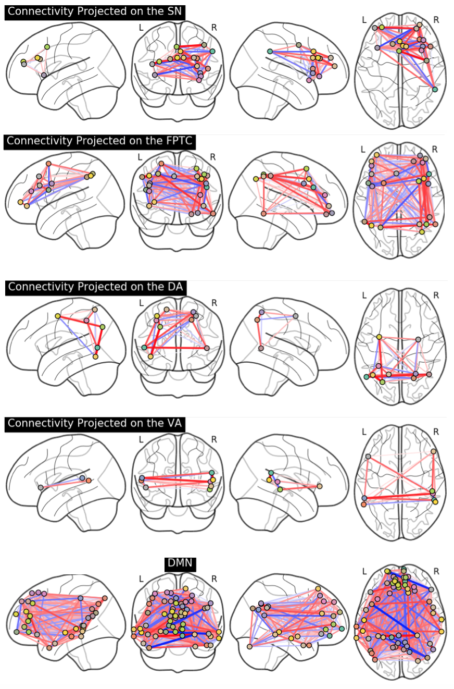

# PyNets
A Python-Powered Workflow for Network Analysis of Resting-State fMRI (rsfMRI)

PyNets utilizes nilearn and bctpy tools in a nipype workflow to automatically generate rsfMRI networks (whole-brain, or RSN's like the DMN) based on a variety of atlas-defined parcellation schemes, and then automatically plot associated adjacency matrices, connectome visualizations, and extract the following graph theoretical measures from those networks (both binary and weighted undirected versions, with a 90% thresholding):\
efficiency, modularity finetune, modularity louvain, transitivity, assortativity, community louvain, density, mean clustering coefficient \
For more information on interpeting these measures, see:
https://sites.google.com/site/bctnet/measures/list 

1. Installation
```python
##You will firstly need the development version of nipype available on github
git clone https://github.com/nipy/nipype
cd nipype
python setup.py install

##Second you will need to clone the PyNets repo and install dependencies
git clone https://github.com/dpisner453/PyNets.git
cd /path/to/PyNets
pip install -r requirements.txt 

##If you run into any problems at run time, try installing the optional features of nipype with:
pip install nipype[all]
```

2. Usage:\
Situation A) You have a normalized (MNI-space), preprocessed functional rsfMRI image called "filtered_func_data_clean_standard.nii.gz" where the subject id=002, you wish to extract network metrics for a whole-brain network, using the 264-node atlas parcellation scheme from Power et al. 2011 called 'coords_power_2011', and your rsfMRI image was collected with a TR=2 seconds:
```python
python /path/to/PyNets/PyNets.py '/Users/dpisner453/PyNets_examples/002/filtered_func_data_clean_standard.nii.gz' '002' \
'coords_power_2011' '2'
```
&nbsp;&nbsp;&nbsp;&nbsp;&nbsp; Situation B) You have a normalized (MNI-space), preprocessed functional rsfMRI image called "filtered_func_data_clean_standard.nii.gz" where the subject id=002, you wish to extract network metrics for the DMN network, using the 264-node atlas parcellation scheme from Power et al. 2011 called 'coords_power_2011' (currently the only atlas supported for extracting RSN networks in PyNets!), and your rsfMRI image was collected with a TR=2 seconds:
```python
python /path/to/PyNets/PyNets.py '/Users/dpisner453/PyNets_examples/002/filtered_func_data_clean_standard.nii.gz' '002' \
'coords_power_2011' '2' 'DMN'
```
&nbsp;&nbsp;&nbsp;&nbsp;&nbsp; Situation C) You only have your time-series in a text or csv-like file where the matrix is saved in the format of # of functional volumes x # of ROI's:

```python
python /path/to/PyNets/PyNets.py '/Users/dpisner453/PyNets_examples/200/roi_CC200.1D' '200'
```

3. Viewing outputs:\
&nbsp;&nbsp;&nbsp;&nbsp;&nbsp; PyNets outputs network metrics into text files and pickled pandas dataframes within the same subject folder 
in which the initial image or time-series was fed into the workflow. To open the pickled pandas dataframes
from within the interpreter, you can:
```python
import pandas as pd
##Assign pickle path for the covariance (as opposed to the sparse inverse covariance net)
pickle_path = '/Users/dpisner453/PyNets_examples/200/200_net_global_scalars_cov_200'
df = pd.read_pickle(pickle_path)
df
```

&nbsp;&nbsp;&nbsp;&nbsp;&nbsp; These dataframes can then be iteratively loaded and aggregated by row into a single dataframe, where there is 1 row per subject. Here is an example of what that code could look like (where 'frame' here is the aggregated df):
```python
import glob
import os
import pandas as pd
path = r'/Users/dpisner453/PyNets_examples/network_analysis/' # use your path
allFiles = []
for fn in os.listdir(path):
    path_name = path + fn + '/' + fn + '_DMN_net_global_scalars_inv_sps_cov_' + fn
    print(path_name)
    allFiles.append(path_name)

frame = pd.DataFrame()
list_ = []

for file_ in allFiles:
    df = pd.read_pickle(file_)
    list_.append(df)

frame = pd.concat(list_)
```
4. Coming soon (or for any interested developers):\
&nbsp;&nbsp;&nbsp;&nbsp;&nbsp; a) Optionally incorporate a confound regressor into your covariance/ sparse inverse covariance matrix estimation (for now, PyNets assumes this has already been done)\
&nbsp;&nbsp;&nbsp;&nbsp;&nbsp; b) Iterate network metric extraction over more atlas-defined and/or group-ICA masked RSN's (right now limited to DMN, FPTC, VA, DA, SN as defined by the Power et al. 2011 264-node atlas)



Happy Netting!
