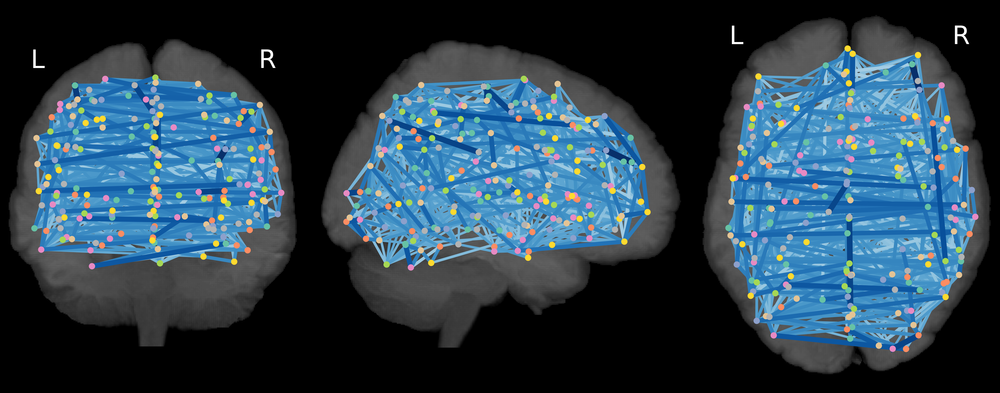
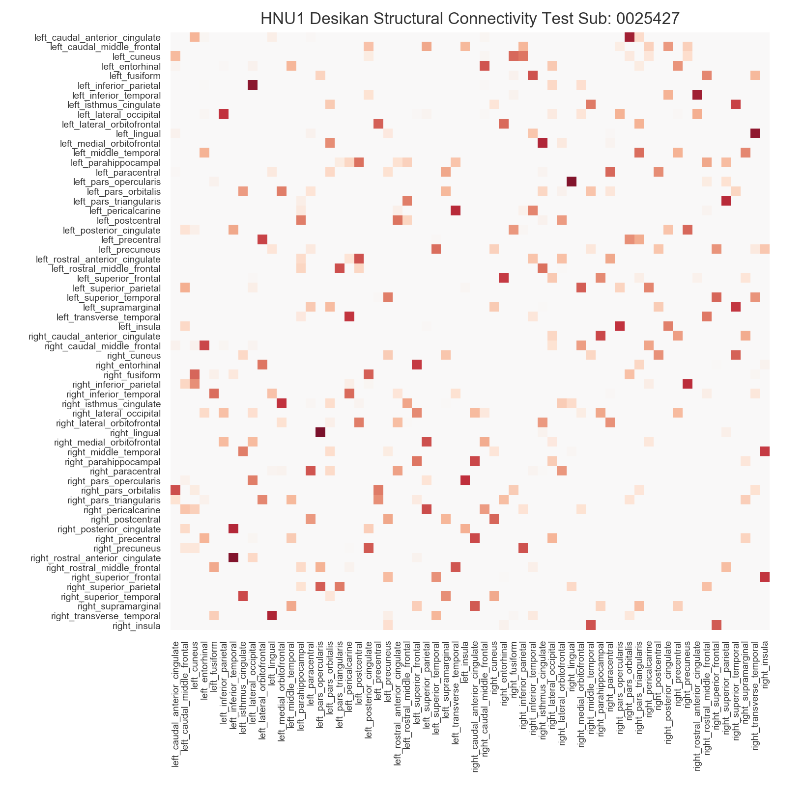
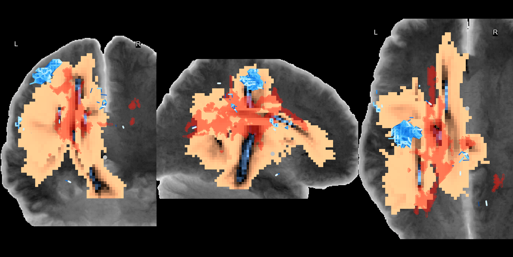
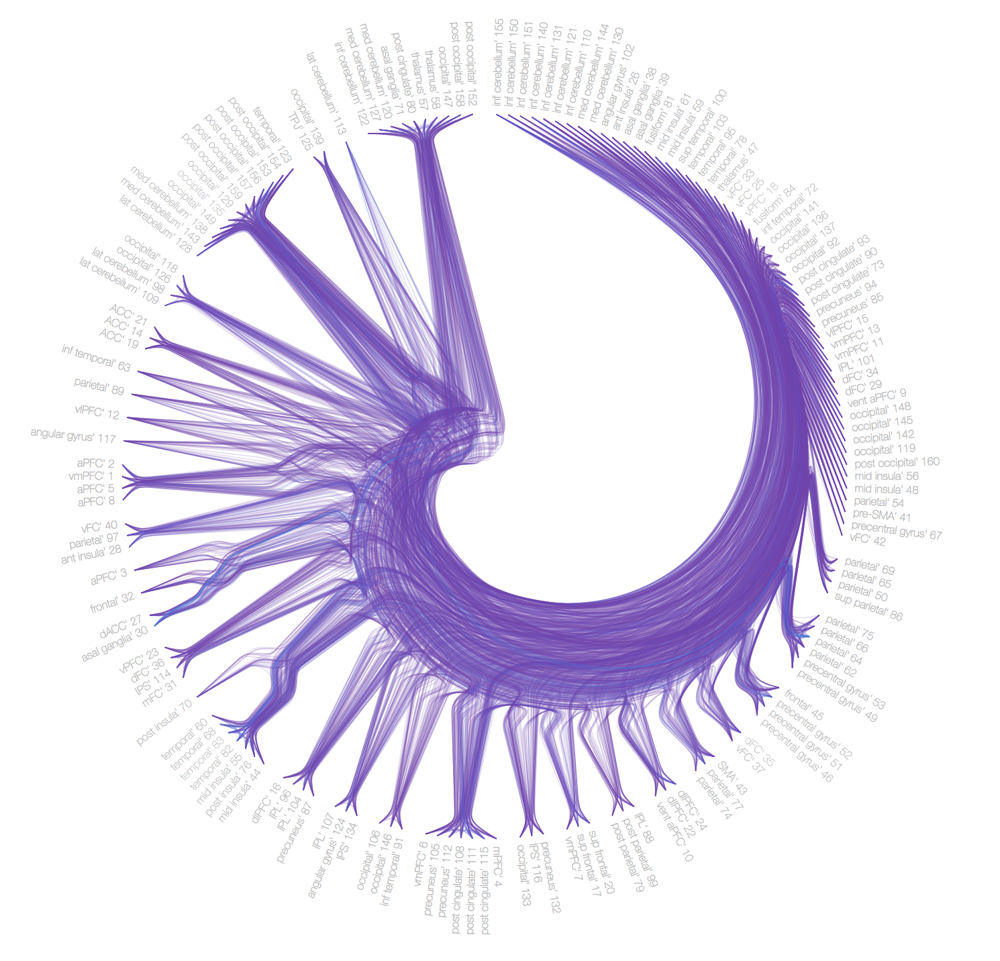

PyNets™
======

About
-----
A Python-Powered Workflow for Fully-Reproducible Network Analysis of Functional and Structural Connectomes

PyNets harnesses the power of Nipype, Nilearn, and Networkx packages to automatically generate a variety of 'meta-connectomic' solutions on a subject-by-subject basis, using any combination of graph hyperparameters. PyNets utilities can be integrated with any existing preprocessing workflow, and a docker container is provided to uniquely facilitate complete reproducibility of executions.

Learn more about Nipype: http://nipype.readthedocs.io/
Learn more about Nilearn http://nilearn.github.io/
Learn more about Networkx: https://networkx.github.io/

-----

1. Installation
PyNets is available for both python2 and python3. We recommend using python3.
```python
##Clone the PyNets repo and install dependencies
git clone https://github.com/dPys/PyNets.git
cd /path/to/PyNets
python setup.py install

#Or within the PyNets parent directory:
pip install -e .

#Or install from PyPi (recommended)
pip install pynets
```

To install using the included dockerfile, ensure you have installed Docker (https://www.docker.com/) and then run:
```
BUILDIR=$(pwd)
mkdir -p ${BUILDIR}/pynets_images
docker build -t pynets_docker .

docker run -ti --rm --privileged \
    -v /tmp:/tmp \
    -v /var/tmp:/var/tmp \
    pynets_docker
```

and to further convert this into a singularity container for HPC:

```
docker run -ti --rm --privileged \
    -v /tmp:/tmp \
    -v /var/tmp:/var/tmp \
    pynets_singularity
```

2. Usage:

See pynets_run.py -h for help options.

Quick Start:

Example A) You have a preprocessed (minimally -- normalized and skull stripped) functional fMRI dataset called "filtered_func_data_clean_standard.nii.gz" where you assign an arbitrary subject id of 997, you wish to analyze a whole-brain network, using the nilearn atlas 'coords_dosenbach_2010', thresholding the connectivity graph proportionally to retain 0.20% of the strongest connections, and you wish to use partial correlation model estimation:
```python
pynets_run.py '/Users/dpisner453/PyNets_examples/997/filtered_func_data_clean_standard.nii.gz' -id '997' -a 'coords_dosenbach_2010' -mod 'partcorr' -thr '0.20'
```
&nbsp;&nbsp;&nbsp;&nbsp;&nbsp; Example B) Building upon the previous example, let's say you now wish to analyze the Default network for this same dataset, but now also using the 264-node atlas parcellation scheme from Power et al. 2011 called 'coords_power_2011', you wish to threshold the graph iteratively to achieve a target density of 0.3, and you define your node radius at two resolutions (2 and 4 mm), you wish to fit a  sparse inverse covariance model in addition to partial correlation, and you wish to plot the results:
```python
pynets_run.py -i '/Users/dpisner453/PyNets_examples/997/filtered_func_data_clean_standard.nii.gz' -id '997' -a 'coords_dosenbach_2010,coords_power_2011' -n 'Default' -dt -thr '0.3' -ns '2,4' -mod 'partcorr,sps' -plt
```

&nbsp;&nbsp;&nbsp;&nbsp;&nbsp; Example C) Building upon the previous examples, let's say you now wish to analyze the Default and Executive Control Networks for this subject, bot this time based on a custom atlas (DesikanKlein2012.nii.gz), this time defining your nodes as parcels (as opposed to spheres), you wish to fit a partial correlation model, you wish to iterate the pipeline over a range of densities (i.e. 0.05-0.10 with 1% step), and you wish to prune disconnected and low importance (3 SD < M) nodes:
```python
pynets_run.py -i '/Users/dpisner453/PyNets_examples/997/filtered_func_data_clean_standard.nii.gz' -id '997' -ua '/Users/dpisner453/PyNets_example_atlases/DesikanKlein2012.nii.gz' -n 'Default,Cont' -mod 'partcorr' -dt -min_thr 0.05 -max_thr 0.10 -step_thr 0.01 -parc -p
```

&nbsp;&nbsp;&nbsp;&nbsp;&nbsp; Example D) Building upon the previous examples, let's say you now wish to create a subject-specific atlas based on the subject's unique spatial-temporal profile. In this case, you can specify the path to a binarized mask within which to performed spatially-constrained spectral clustering, and you want to try this at multiple resolutions of k clusters/nodes (i.e. k=50,100,150). You again also wish to define your node radius at both 2 and 4 mm, fitting a partial correlation and sparse inverse covariance model, you wish to iterate the pipeline over a range of densities (i.e. 0.05-0.10 with 1% step), you wish to prune disconnected and low importance (3 SD < M) nodes, and you wish to plot your results:
```python
pynets_run.py -i '/Users/dpisner453/PyNets_examples/997/filtered_func_data_clean_standard.nii.gz' -id '997' -cm '/Users/dpisner453/PyNets_example/997_grey_matter_mask_bin.nii.gz' -ns '2,4' -mod 'partcorr,sps' -k_min 50 -k_max 150 -k_step 50 -dt -min_thr 0.05 -max_thr 0.10 -step_thr 0.01 -p -plt
```

&nbsp;&nbsp;&nbsp;&nbsp;&nbsp; Example E) You wish to generate a structural connectome, using probabilistic tractography applied to bedpostx outputs with 5000 streamlines, constrained to a white-matter waypoint mask, and avoiding ventricular CSF as defined by the subject's T1 image. You wish to use atlas parcels as defined by both DesikanKlein2012, and AALTzourioMazoyer2002, iterate over a range of densities (i.e. 0.05-0.10 with 1% step), prune disconnected and low importance (3 SD < M) nodes, and plot your results:
```python
pynets_run.py -dwi /Users/PSYC-dap3463/Downloads/bedpostx_s002.bedpostX -id s002 -ua '/Users/PSYC-dap3463/Applications/PyNets/pynets/atlases/DesikanKlein2012.nii.gz,/Users/PSYC-dap3463/Applications/PyNets/pynets/atlases/AALTzourioMazoyer2002' -s 5000 -thr 0.1 -dt -min_thr 0.05 -max_thr 0.10 -step_thr 0.01 -p -parc -anat '/Users/PSYC-dap3463/Downloads/s002/s002_anat_T1.nii.gz'
```

3. Viewing outputs:\
&nbsp;&nbsp;&nbsp;&nbsp;&nbsp; PyNets outputs network metrics into csv files and pickled pandas dataframes within the same subject folder
in which the initial image or time-series was fed into the workflow. To open the pickled pandas dataframes
from within the interpreter, you can:

```python
import pandas as pd
##Assign pickle path for the covariance (as opposed to the sparse inverse covariance net)
pickle_path = '/Users/dpisner453/PyNets_examples/200/200_net_global_scalars_cov_200'
df = pd.read_pickle(pickle_path)
df
```

&nbsp;&nbsp;&nbsp;&nbsp;&nbsp; These dataframes can then be iteratively loaded and aggregated by row into a single dataframe across subjects, where there is 1 row per subject. Here is an example of what that code could look like (where 'frame' here is the aggregated df):
```python
import glob
import os
import pandas as pd
###
working_path = r'/work/04171/dpisner/data/ABM/network_analysis/' # use your path
name_of_network_pickle = 'net_metrics_sps_Default_mean'
###

allFiles = []
for ID in os.listdir(working_path):
    path_name = working_path + ID + '/' + ID + '_' + name_of_network_pickle
    if os.path.isfile(path_name):
        print(path_name)
        allFiles.append(path_name)

frame = pd.DataFrame()
list_ = []

for file_ in allFiles:
    df = pd.read_pickle(file_)
    node_cols = [s for s in list(df.columns) if isinstance(s, int) or any(c.isdigit() for c in s)]
    list_.append(df)

frame = pd.concat(list_)

out_path = working_path + '/' + name_of_network_pickle + '_output.csv'
frame.to_csv(out_path)
```
Generate a glass brain plot for a functional or structural connectome

Visualize adjacency matrices for structural or functional connectomes

Input a path to a bedpostx directory to estimate a structural connectome

Visualize communities of restricted networks

Use connectograms to visualize community structure (including link communities)


Happy Netting!

Please cite all uses with reference to the github repository: https://github.com/dPys/PyNets
